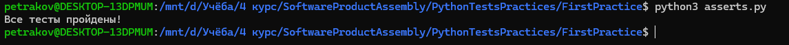
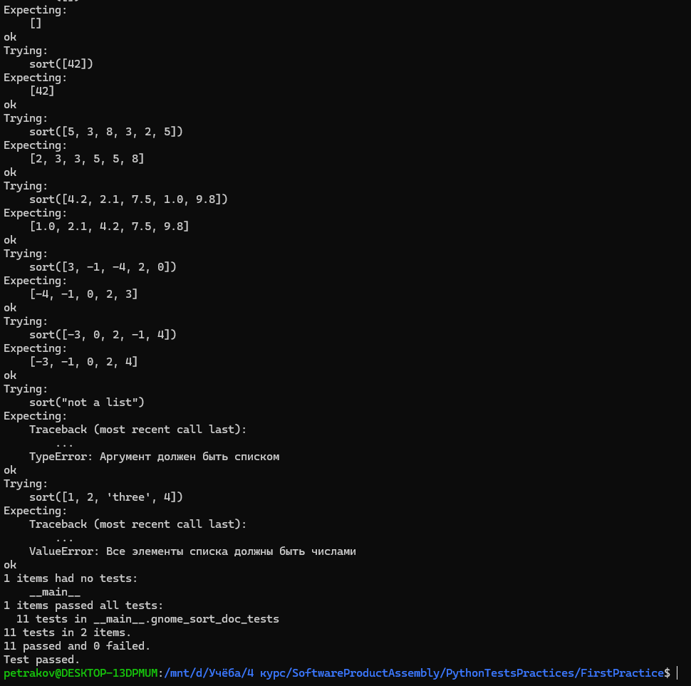
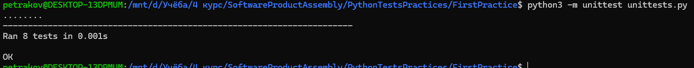

# Практическая работа #1: Тестирование алгоритма сортировки

## Описание

В данной практической работе реализован алгоритм сортировки, известный как **Гномья сортировка**. Для проверки его корректности использованы три подхода к тестированию:

1. Непосредственное использование инструкции `assert`
2. Модуль `doctest`
3. Модуль `unittest`

## Алгоритм

### Гномья сортировка

Гномья сортировка — это простая сортировка, основанная на сравнении соседних элементов. Если текущий элемент меньше предыдущего, элементы меняются местами. Алгоритм продолжает двигаться назад, пока не будет выполнено условие, что текущий элемент больше или равен предыдущему.

```python
def sort(array):
    if not isinstance(array, list):  # --аргумент является списком--
        raise TypeError("Аргумент должен быть списком")
    
    if not all(isinstance(x, (int, float)) for x in array):  # --проверка, что все элементы списка числа--
        raise ValueError("Все элементы списка должны быть числами")

    index = 0
    while index < len(array):
        if index == 0 or array[index] >= array[index - 1]:
            index += 1
        else:
            array[index], array[index - 1] = array[index - 1], array[index]
            index -= 1
    return array
```

## Тестирование

### 1. Тестирование с использованием `assert`

Пример тестов, проверяющих корректность работы функции:

```python
def test_1():
    assert sort([4, 2, 7, 1, 9, 3]) == [1, 2, 3, 4, 7, 9], \
        f"Ожидалось [1, 2, 3, 4, 7, 9], получено {sort([4, 2, 7, 1, 9, 3])}"
    # Другие тесты...
```

### 2. Тестирование с использованием `doctest`

Документированные тесты для функции сортировки:

```python
def gnome_sort_doc_tests(array):
    """
    Тесты для функции сортировки методом гномьей сортировки.
    >>> sort([4, 2, 7, 1, 9, 3])
    [1, 2, 3, 4, 7, 9]
    # Другие тесты...
    """
```

Для запуска тестов с `doctest`:

```python
if __name__ == '__main__':
    import doctest
    doctest.testmod()
```

### 3. Тестирование с использованием `unittest`

Полный набор тестов с использованием `unittest`:

```python
import unittest

class TestGnomeSort(unittest.TestCase):
    def test_sort_ordinary_cases(self):
        self.assertEqual(sort([4, 2, 7, 1, 9, 3]), [1, 2, 3, 4, 7, 9])
    # Другие тесты...
    
if __name__ == '__main__':
    unittest.main()
```

## Запуск тестов

Чтобы запустить тесты, используйте следующий команду:

### 1. Запуск тестов с использованием `assert`

Запустите файл с тестами, например:

```bash
python asserts.py
```

### 2. Запуск тестов с использованием `doctest`

Для запуска тестов, встроенных в документированное описание функции, выполните:

```bash
python doctests.py -v
```

### 3. Запуск тестов с использованием `unittest`

Чтобы запустить тесты с использованием `unittest`, выполните команду:

```bash
python -m unittest unittests.py
```

## Заключение

В данной работе были протестированы три метода тестирования для функции гномьей сортировки. Все тесты пройдены успешно, что подтверждает корректность реализации алгоритма.

## Результат работы

### Тесты с использованием `assert`



### Тесты с использованием `doctest`



### Тесты с использованием `unittest`

