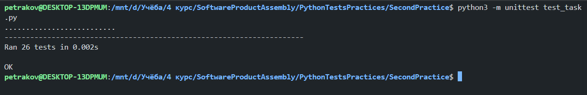
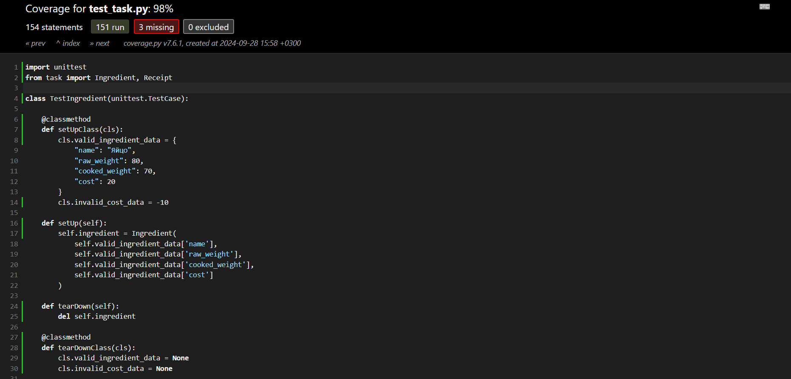

# Отчет по практической работе №2

## 1. Введение

В данной работе была разработана модель для сервиса, связанного с рецептами и ресторанами. С целью расчета расходов на закупку ингредиентов был реализован код, имитирующий получение данных от проектируемого API. Были созданы два класса: `Ingredient` (Ингредиент) и `Receipt` (Рецепт).

## 2. Задачи

-   Создать класс для представления ингредиентов.
-   Создать класс для представления рецептов, который включает в себя список ингредиентов.
-   Реализовать методы для расчета стоимости и веса ингредиентов.
-   Написать юнит-тесты для проверки корректности работы классов.

## 3. Выбор блюда

Для работы была выбрана пара блюд, начиная с буквы, соответствующей фамилии выполняющего практическую работу:

-   ### (П)етраков -> (П)арфе (Парфе с ягодами и сливками)

## 4. Реализация

### 4.1. Код класса Ingredient

```python
class Ingredient:
    MAX_COST = 1000

    def __init__(self, name: str, raw_weight: (int, float), cooked_weight: (int, float), cost: (int, float)) -> None:
        self.name = name
        self.raw_weight = raw_weight
        self.cooked_weight = cooked_weight
        self.cost = cost

    @property
    def raw_weight(self):
        return self._raw_weight

    @raw_weight.setter
    def raw_weight(self, value):
        if not isinstance(value, (int, float)):
            raise ValueError("Raw weight must be a number.")
        if value <= 0:
            raise ValueError("Raw weight must be positive.")
        self._raw_weight = value

    @property
    def cooked_weight(self):
        return self._cooked_weight

    @cooked_weight.setter
    def cooked_weight(self, value):
        if not isinstance(value, (int, float)):
            raise ValueError("Cooked weight must be a number.")
        if value <= 0:
            raise ValueError("Cooked weight must be positive.")
        self._cooked_weight = value

    @property
    def cost(self):
        return self._cost

    @cost.setter
    def cost(self, value):
        if not isinstance(value, (int, float)):
            raise ValueError("Cost must be a number.")
        if value < 0:
            raise ValueError("Cost must be non-negative.")
        if value > 1000:
            raise ValueError("Cost exceeds the maximum allowed value.")
        self._cost = value

    def __str__(self) -> str:
        return (
            f"---------------------\n"
            f"Ingredient: {self.name}\n"
            f"Raw Weight: {self.raw_weight}\n"
            f"Cooked Weight: {self.cooked_weight}\n"
            f"Cost: ${self.cost:.2f}\n"
            f"---------------------\n"
        )
```

### 4.2. Код класса Receipt

```python
class Receipt:
    def __init__(self, name: str, ingredient_list: list[tuple[str, float, float, float]]):
        self.name = name
        self.ingredients = [Ingredient(*ingredient) for ingredient in ingredient_list]

    @property
    def name(self):
        return self._name

    @name.setter
    def name(self, value: str):
        if not isinstance(value, str):
            raise ValueError("Recipe name must be a string.")
        if not value.strip():
            raise ValueError("Recipe name cannot be empty.")
        self._name = value

    @property
    def ingredients(self):
        return self._ingredients

    @ingredients.setter
    def ingredients(self, value: list[Ingredient]):
        if not isinstance(value, list):
            raise ValueError("Ingredients must be a list.")
        if not all(isinstance(ingredient, Ingredient) for ingredient in value):
            raise ValueError("All items in the ingredient list must be instances of Ingredient.")
        if not value:
            raise ValueError("Ingredient list cannot be empty.")
        self._ingredients = value

    def calc_cost(self, portions=1):
        total_cost = sum(ingredient.cost for ingredient in self.ingredients)
        return total_cost * portions

    def calc_weight(self, portions=1, raw=True):
        if raw:
            total_weight = sum(ingredient.raw_weight for ingredient in self.ingredients)
        else:
            total_weight = sum(ingredient.cooked_weight for ingredient in self.ingredients)
        return total_weight * portions

    def __str__(self) -> str:
        ingredient_details = "\n".join(str(ingredient) for ingredient in self.ingredients)
        return (
            f"Recipe: {self.name}\n### All Receipt Ingredients ###\n{ingredient_details}"
        )
```

### 4.3. Тестирование

Для тестирования классов были написаны юнит-тесты с использованием библиотеки `unittest`. Основные аспекты, которые тестировались:

-   Корректность создания объектов класса `Ingredient` и `Receipt`.
-   Проверка на корректность вводимых данных (проверка на ошибки).
-   Расчеты стоимости и веса ингредиентов.

#### Пример юнит-тестов

```python
import unittest
from task import Ingredient, Receipt

class TestIngredient(unittest.TestCase):

    @classmethod
    def setUpClass(cls):
        cls.valid_ingredient_data = {
            "name": "Яйцо",
            "raw_weight": 80,
            "cooked_weight": 70,
            "cost": 20
        }
        cls.invalid_cost_data = -10

    def setUp(self):
        self.ingredient = Ingredient(
            self.valid_ingredient_data['name'],
            self.valid_ingredient_data['raw_weight'],
            self.valid_ingredient_data['cooked_weight'],
            self.valid_ingredient_data['cost']
        )

    def tearDown(self):
        del self.ingredient

    @classmethod
    def tearDownClass(cls):
        cls.valid_ingredient_data = None
        cls.invalid_cost_data = None

    # Тесты на проверку валидности
    def test_valid_ingredient(self):
        self.assertEqual(self.ingredient.name, "Яйцо")
        self.assertEqual(self.ingredient.raw_weight, 80)
        self.assertEqual(self.ingredient.cooked_weight, 70)
        self.assertEqual(self.ingredient.cost, 20)

# Аналогичные тесты для класса Receipt...

if __name__ == "__main__":
    unittest.main()
```

## 4.4. Запуск тестов для покрытия

Для запуска тестов и получения отчета о покрытии выполните следующие команды:

```bash
sudo apt-get update
sudo apt install python3-pip
sudo pip install coverage

coverage run -m unittest test_task.py
coverage report
coverage html
```

## 5. Заключение

В результате работы был успешно реализован код для расчета расходов на закупку ингредиентов, а также написаны тесты для проверки его работоспособности. Код поддерживает расширяемость и может быть дополнен новыми функциями по мере необходимости. Тесты показали высокое покрытие, что свидетельствует о надежности разработанной модели.

## Полученный результат




## HTML


